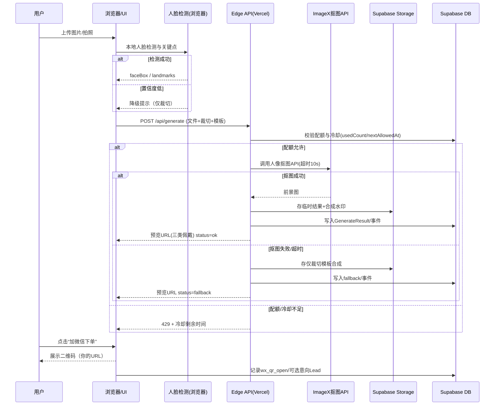
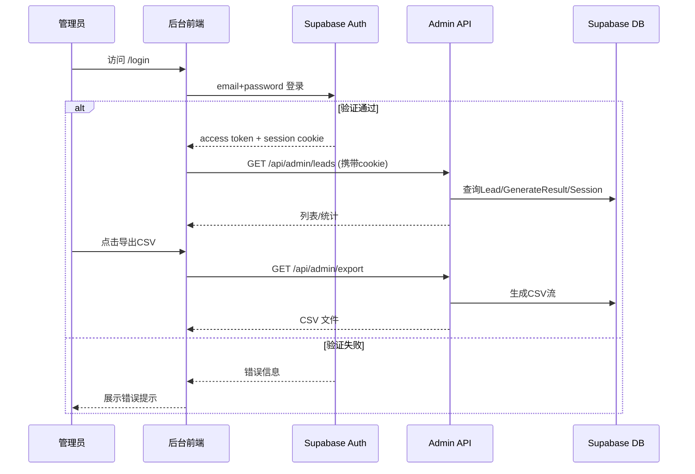

# 吧唧生成与佩戴预览 — 产品路线图与PRD（MVP）

本文件为本项目的最终确认版“产品路线图 + 架构设计蓝图 + 选定MVP原型”存档。当前版本聚焦 MVP 的单一闭环：上传→自动居中/抠图→模板合成→三类佩戴预览→加微信下单。

- 品牌名：待定（主色为“洛天依蓝”）
- 主色建议：#3BA7FF（可在主题变量中替换）
- 微信二维码：https://youke1.picui.cn/s1/2025/09/08/68bea85ed0b44.jpg
- 特殊文案：长沙理工大学：一件可送（校内，可含邮）；湖南其他地区：探索中，以微信沟通为准
- 免费额度与冷却：每会话/每日 5 次，每次生成需间隔≥60秒
- 数据清理：未留资 24h 自动清理；留资保留 7 天
- 托管与技术：Vercel + Supabase(Postgres/Auth/Storage) + Cloudflare（CDN）+ 火山引擎 ImageX 人像抠图（HTTP API）


## 核心目标 (Mission)
一键生成吧唧与三类通用佩戴预览（上衣/背包/帽子），以“低门槛体验+微信转化”支撑校园一件起做与快速成交。


## 用户画像 (Persona)
- 中国大学生；偏好二次元/社团/同人；预算有限、追求即看即得；不希望暴露“AI”痕迹；以微信沟通达成交易。


## V1: 最小可行产品 (MVP)
- 上传与自动居中：本地/拍照上传；浏览器端人脸检测自动居中；支持手动拖拽/缩放微调。
- 模板与尺寸：圆形 58/75mm 两档；基础背景（纯色/渐变）；主色“洛天依蓝”。
- 抠图生成（火山引擎 ImageX）：服务端仅调用人像抠图/前景分割API（非生图模型），返回透明PNG；失败自动回退仅裁切模板合成。
- 三类佩戴预览：上衣/背包/帽子通用模特图；预览加品牌水印（不出现“AI”字样）。
- 免费额度与冷却：每会话/每日 5 次生成；每次间隔≥60秒；若5次皆“不满意”，提示稍后再试（显示倒计时与次日刷新）。
- 成交路径（无在线支付）：醒目标注“长沙理工大学：一件可送（校内，可含邮）”；主CTA“加微信下单”，弹出二维码（用上方链接）。
- 后台管理与账号：管理员可注册/登录（邮箱+密码），进入后台查看额度/生成记录/线索；支持密码重置与安全退出。
- 线索收集与管理：可选填写昵称/数量/尺寸，生成意向号；受保护管理页导出CSV、按日期筛选、查看失败原因与耗时。
- 数据清理：未留资预览与源图 24h 自动清理；留资保留7天；媒体URL短期有效+CDN缓存。
- 埋点：曝光、上传、检测成功、生成成功/失败、冷却、额度用尽、二维码打开、意向提交。


## V2 及以后版本 (Future Releases)
- 模板扩展与编辑器：更多边框/贴纸/文字环形排版、滤镜、描边、多图拼贴。
- 批量/社团：批量导入名单与照片，一键生成与打包。
- 在线支付与订单：微信/支付宝直付、订单状态、物流与开票。
- 账号与相册：登录、作品库、再次下单、收藏/分享（展示与否可控）。
- 小程序版：迁移核心闭环，使用平台端登录与支付。
- A/B 与增长：渐进启用；网页不硬展示社群入口。


## 关键业务逻辑 (Business Rules)
- 文件与检测：JPG/PNG ≤10MB；自动旋转EXIF；多人脸→提示选择或更换；低置信度→降级仅裁切。
- 居中策略：基于人脸框+关键点，使头顶-下巴覆盖圆心60–70%；用户可手动覆盖。
- 抠图容错：火山引擎 ImageX 超时>10s→提示“后台生成中，可先看裁切预览”；失败→回退仅裁切模板。
- 后台账号：
  - 注册仅限内部管理员（首个账号由环境变量约定邀请码，之后需登录后创建）；
  - 邮箱+密码（≥8位+大小写+数字）+ Supabase Auth；
  - 登录后签发HttpOnly cookie，30分钟无操作失效，可手动注销；
  - 密码重置通过Supabase重置邮件链接（限绑定邮箱）；
  - 管理模块接口仅在已登录、角色=admin时开放。
- 免费额度与冷却：
  - 冷却：每次生成后需等待≥60s（显示倒计时与“可再次生成时间点”）。
  - 配额：每会话/每日 5 次；用户标记“不满意”仍计入额度；5次后引导“明天再试/更换更清晰正脸图”。
- 水印策略：品牌水印+轻防盗（不含“AI”字样）；高清无水印仅线下成交后提供。
- 成交文案：固定展示“长沙理工大学：一件可送（校内，可含邮）；湖南其他地区：探索中，以微信沟通为准”。


## 数据契约 (Data Contract)
- UserSession: `sessionId`(string), `ua`(string), `locale`('zh-CN'), `createdAt`(ts), `dailyQuota`(number=5), `usedCount`(number), `nextAllowedAt`(ts), `ipHash`(string)
- Upload: `uploadId`, `sessionId`, `fileName`, `mime`, `size`, `width`, `height`, `exifRot`, `createdAt`
- Detection: `uploadId`, `faceBox`({x,y,w,h}), `landmarks`?, `score`(0–1), `createdAt`
- CropSettings: `uploadId`, `scale`, `offsetX`, `offsetY`, `rotation`
- Template: `templateId`, `name`, `shape`('circle'), `sizeMm`(58|75), `bgStyle`('solid'|'gradient'), `paletteId`
- GenerateRequest: `requestId`, `uploadId`, `templateId`, `useApi`(true), `vendor`('volcengine_imagex'), `params`(json), `createdAt`
- GenerateResult: `requestId`, `imageUrl`, `previewWearUrls`(string[]), `watermarked`(bool), `latencyMs`, `status`('ok'|'fallback'|'failed')
- Lead: `leadId`, `sessionId`, `requestId`, `university`?, `sizeMm`, `count`(=1), `note`?, `wxQrShownAt`?, `submittedAt`?
- Policy: `freeItemUniversities`(string[]=['长沙理工大学']), `campusFreeIncludesPost`(true), `dailyQuotaDefault`(5), `cooldownSec`(60)
- Event: `eventId`, `sessionId`, `type`('view'|'upload_start'|'upload_ok'|'detect_ok'|'preview_ok'|'cooldown'|'quota_exhausted'|'wx_qr_open'|'lead_submit'), `meta`(json), `ts`
- AdminUser: `id`, `email`, `passwordHash`, `role`('admin'), `createdAt`, `createdBy`
- AdminSession: `sessionId`, `adminId`, `issuedAt`, `expiresAt`, `userAgent`, `ipHash`


## MVP 原型（选定）
选定方案：1) 霓虹单屏闭环（酷炫“二次元街”氛围）

```
+----------------------------------------------------------------------------------+
| █ LOGO (霓虹蓝)          [长沙理工：一件可送（校内/可含邮）]        ⌛额度: 3/5 60s  |
+----------------------------------------------------------------------------------+
| [① 上传/裁切]                         | [② 模板/尺寸]                    |
|  ┌──────────────┐                     |  圆形: (•)58mm  ( )75mm          |
|  | 预览(可拖缩) |  人脸检测: ✓        |  背景: (•)纯色  ( )渐变           |
|  |     ◯        |  重新选择图片       |  主题: 洛天依蓝 / 霓虹青 / 紫      |
|  └──────────────┘                     |  [生成/再次生成 ▶]（倒计时）     |
+----------------------------------------------------------------------------------+
| [③ 佩戴预览]  上衣 | 背包 | 帽子   （水印）                                   |
|   ┌──────────┐  ┌──────────┐  ┌──────────┐                                      |
|   |  上衣图  |  |  背包图  |  |  帽子图  |  （点击放大）                         |
|   └──────────┘  └──────────┘  └──────────┘                                      |
+----------------------------------------------------------------------------------+
|         [ 加微信下单 ]   扫码或长按识别 →  [ 显示二维码 ]                       |
|                            二维码图：你提供的URL                                  |
+----------------------------------------------------------------------------------+
```


## 架构设计蓝图

### 核心流程图（Mermaid 序列图）


#### 管理后台登录与导出流程


### 组件交互说明
- 前端(Next.js, App Router)：
  - `app/page.tsx`：单屏主页面（上传/裁切 → 模板 → 预览 → CTA）
  - 组件：`UploadCropper`, `TemplatePicker`, `QuotaBadge`, `PreviewWear`, `WxQRCodeModal`
  - `lib/face-detect`：浏览器人脸检测（Human/MediaPipe）
  - `lib/quota`：读取/展示额度与冷却倒计时（与后端对齐）
- 后端(Edge Route Handlers)：
  - `app/(auth)/register/page.tsx` & `app/(auth)/login/page.tsx`：管理员注册与登录表单（调用Supabase Auth）
  - `app/(auth)/forgot-password/page.tsx`：触发Supabase密码重置邮件
  - `app/api/auth/register` + `app/api/auth/login|logout`：服务端校验邀请码、生成HttpOnly cookie
  - `app/api/admin/leads|stats|export`：校验Supabase Auth session，返回线索、统计、CSV下载
  - `app/admin/layout.tsx` + `app/admin/page.tsx`：登录后访问后台仪表盘、线索列表、导出
  - `app/api/generate/route.ts`：配额校验→ImageX抠图代理→水印合成→存储→返回预览URL
  - `app/api/lead/route.ts`：存线索（需校验sessionId，可选绑定adminId）
  - `app/api/quota/route.ts`：返回剩余额度与nextAllowedAt
- 数据与清理：
  - Supabase Postgres：Session/Upload/Request/Result/Lead/Event/Policy
  - Supabase Storage：原图/中间结果/水印预览（签名短链）
  - Vercel Cron/Supabase 任务：定时清理>24h未留资对象与记录

### 技术选型与风险
- 框架与UI：Next.js + TypeScript + Tailwind + shadcn/ui（优点：快速、SSR/Edge兼容；风险：样式主题需统一变量）
- 人脸检测：浏览器端（Human/MediaPipe）（优点：零后端成本、低延迟；风险：移动端性能与模型体积，需懒加载/降级）
- 抠图：火山引擎 ImageX 人像抠图API（优点：成品透明PNG、无需自建模型；风险：需关注QPS/费用，保底提供仅裁切降级）
- 认证：Supabase Auth (email+password) + RLS（优点：开箱即用；风险：需限制注册入口、管理token安全）
- 存储与DB：Supabase（优点：开发快；风险：区域延迟/带宽，建议选择近区域并用Cloudflare加速）
- CDN：Cloudflare（优点：缓存与高可用；风险：签名URL与缓存协同需谨慎设置）
- 防刷与配额：Edge 侧基于 cookie session + ipHash + DB 计数（风险：无登录的会话识别有限，可加入指纹与速率限制）
- 合规：MVP阶段暂不处理，后续补充日志/隐私与条款。


## 运营与文案（MVP）
- 头部固定：长沙理工大学：一件可送（校内，可含邮）
- CTA：加微信下单（弹出二维码）
- 失败提示：图片不清晰/正脸不全→建议换更清晰正脸/光线良好/背景简单
- 额度与冷却：进度条+倒计时，文案说明“每日5次体验，每次间隔60秒”


## 环境与配置建议
- 环境变量：VOLCENGINE_API_KEY, VOLCENGINE_ENDPOINT, SUPABASE_URL, SUPABASE_ANON_KEY, SUPABASE_SERVICE_ROLE, SUPABASE_JWT_SECRET, ADMIN_INVITE_CODE
- 策略参数（DB Policy 表或env）：`dailyQuotaDefault=5`, `cooldownSec=60`, `freeItemUniversities=['长沙理工大学']`, `campusFreeIncludesPost=true`
- 主题变量：`--color-primary: #3BA7FF`（可扩展霓虹青/紫作辅色）


## 交付与验收
- 验收标准：
  - 用户三步内看到佩戴预览；
  - 冷却与配额可见且有效；
  - 失败自动回退可用；
  - 二维码弹窗显示正确链接；
  - 未留资24h清理生效（可通过后台查看/日志验证）。
- 成功指标（MVP阶段）：10位使用，≥2付费，≥4添加微信。


---

如需切换为“极简一屏”或“分栏控制”原型，只需告知编号，我将同步更新本PRD与后续实现说明。
